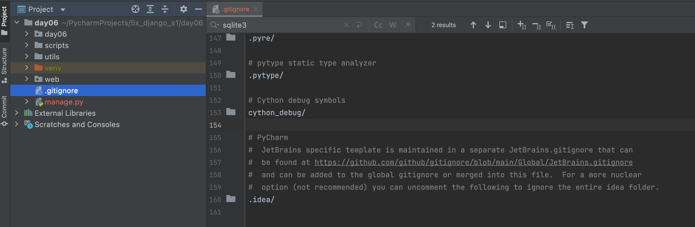
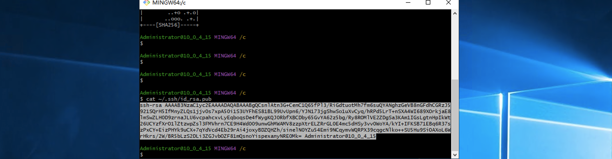

#  Web项目部署


本质三件事：

- 租个服务器（含公网ip）+ 配置环境

  ```
      电脑 + 公网IP
  自己电脑 + 拉专线
  ```

- 代码放在服务器

- 程序运行起来


## 1.购买云服务器

在阿里云、腾讯云或其他平台 购买一台云服务器（选便宜的）。

以下是以 腾讯云 + centos 7.5 操作系统来进行操作。


请记住自己的公网IP，后续用户访问和我们远程登录时，均使用这个IP：

```
82.156.54.134

-[我们]自己电脑远程登录上服务器，在服务器安装各种服务+代码+启动
-[用户]访问程序
```


当购买成功且安装好操作系统之后，请先配置安全组：


## 2.远程登录

后续部署时，需要对服务器进行操作，哪我们必须能登录上服务器才行。


### 2.1 win系统

可以使用 xshell、SecureCRT 等工具。


### 2.2 iTerm2

mac系统可以使用 内置终端、iTerm2等。

https://iterm2.com/


按照上述操作，每次都输入密码，太麻烦了。

在我们本地想要通过SSH连接服务器，每次连接都输入密码也觉得比较烦，此时也可以使用秘钥的方式直接连接服务器。

```
>>>ssh-keygen -t rsa    这个命令不需要做了，因为在之前git上传代码时已执行过（已有公钥和私钥）
```

```
>>>ssh-copy-id  -i  ~/.ssh/id_rsa.pub  root@82.156.54.134
```


那么以后再想要登录远程服务器，就不需要再输入账户和密码了，直接输入：

```
>>>ssh root@82.156.54.134
```


## 中间配置一下虚拟机连接到本机

> 注意用一下NAT桥梁	

### 首先进入到 /etc/sysconfig/network-scripts

```c
cd /etc/sysconfig/network-scripts
```

### 编辑if ifcfg-ens33

```
vi ifcfg-ens33
```

### 修改开启启动网络接口


### 重启网络服务

```
service network restart
```

### 查看ip地址然后ping通本地


```
ip addr show
ping <本机地址>
```

如果不行就重启试试

## 3.代码同步

https://git-scm.com/downloads


上传代码的方式有很多种，例如：FTP工具、scp命令、rsync服务、svn等，不过目前公司主流的都是使用git+代码托管平台。


- 本地电脑，安装git并使用git命令上传代码。
- 代码仓库，创建仓库。
- 服务器，安装git并使用git命令获取最新代码。


### 3.1 本地上传


在本地电脑上本质上需要执行如下步骤：

- 全局配置

  ```
  git config --global user.name "jiguangfeixiang"
  git config --global user.email "jiguangfei"
  ```

- 进入项目目录

  - 初始化

    ```
    git init
    ```

  - 配置远程地址

    ```
    git remote add origin https://gitee.com/wupeiqi/xxxxx.git
    git remote add origin https://github.com/jiguangfeixiang/YunQuNongYou.git
    ```
  
  - 本地版本提交
  
    ```
    git add .
    git commit -m '提交说明...'
    ```
  
  - 提交到远程仓库
  
    ```
    git push origin master
    ```


#### 关于gitignore

在项目中创建一个 `.gitignore`的文件，在里面写上文件名或文件夹，可以git忽略一些文件，不要进行版本控制。

```
https://github.com/github/gitignore/blob/main/Python.gitignore
```


将Python的ignore文件内存拷贝并保存至项目目录下。



这样，就可以控制git忽略某些文件。


#### 关于密码或秘钥

本地提交代码时，每次需要输入密码 & 线上服务器拉去代码时，每次也需要输入密码。

- 固定用户名和密码

  ```
  git remote remove origin
  git remote add origin https://用户名:密码@gitee.com/wupeiqi/xxxxx.git
  ```

- 使用SSH

  - 使用ssh-keygen命令，生成一对秘钥（公钥和私钥）

    ```
    ssh-keygen -t rsa
    ```

    

  - 读取公钥 `~/.ssh/id_rsa.pub`内容并上传到代码托管仓库
    

    

  - 推拉数据

    ```
    git remote add origin git@gitee.com:wupeiqi/xxxxx.git
    git push origin master
    ```

    ```
    git clone git@gitee.com:wupeiqi/xxxxx.git
    ```

    


### 3.2 线上同步

登录线上服务器并获取代码，本质上需要以下三个步骤：

- 登录服务器

  ```
  - 云平台网页版：支持登录并进行命令交互（不便捷，不推荐）。
  - SSH工具，连接比较方便（推荐）
  	- win：xshell、SecureCRT
  	- mac：iTerm2
  
  注意：如果使用SSH工具连接远程服务器的话，需要在云平台的的安全组开启22端口权限。
  ```

- 安装git

  ```
  yum install git -y
  ```

  

- 进入项目克隆或拉取代码

  ```
  基于用户名和密码，需要输入用户和密码
  	git clone https://gitee.com/wupeiqi/xxxxx.git
  	
  基于用户名和密码，直接集成用户和密码
  	git clone https://用户名:密码@gitee.com/wupeiqi/xxxxx.git
  
  基于秘钥：
  	>>>ssh-keygen -t rsa
  	>>>cat ~/.ssh/id_rsa.pub
  	>>>拷贝公钥到代码仓库
  	>>>git clone git@gitee.com:wupeiqi/xxxxx.git
  ```


## 4.配置和部署

### 4.1 MySQL

- 安装服务端

  ```
  yum install mariadb-server -y
  ```

  ```python
  mariadb-server.x86_64 1:5.5.68-1.el7
  ```

- 安装客户端

  ```python
  yum install mariadb -y
  ```

  ```python
  软件包 1:mariadb-5.5.68-1.el7.x86_64 已安装并且是最新版本
  ```

- 服务配置

  - 启动

    ```
    systemctl start mariadb
    systemctl stop mariadb
    ```

  - 设置开机启动

    ```
    systemctl enable mariadb
    ```

- 账号初始化

  - 登录

    ```
    mysql -u root -p
    ```

  - root设置密码

    ```
    UPDATE user SET password=password('qwe123..') WHERE user='root'; 
    flush privileges;
    ```

  - 创建用户

    ```
    insert into mysql.user(user,host,password) values('s4','%',password('qwe123..'));
    flush privileges;
    
    # 或更新密码
    UPDATE user SET password=password('qwe123..') WHERE user='xxx'; 
    flush privileges;
    ```
  
  
  
- 创建数据库
  
    ```
    CREATE DATABASE s4big DEFAULT CHARSET utf8 COLLATE utf8_general_ci;
  ```
  
- 授权
  
    ```
    grant all privileges on 数据库.* to settle@'%';
    flush privileges;
  ```
  
    ```
  grant all privileges on s4big.* to s4@'%';
  flush privileges;
    ```
  
    


### 4.2 Python3

* 下载wget

```
yum install wget 
```

- 安装gcc，用于后续安装Python时编译源码。

  ```python
  yum install gcc -y
  ```

- 安装Python3相关依赖

  ```
  yum install zlib zlib-devel -y
  yum install bzip2 bzip2-devel  -y
  yum install ncurses ncurses-devel  -y
  yum install readline readline-devel  -y
  yum install openssl openssl-devel  -y
  yum install xz lzma xz-devel  -y
  yum install sqlite sqlite-devel  -y
  yum install gdbm gdbm-devel  -y
  yum install tk tk-devel  -y
  yum install mysql-devel -y
  yum install python-devel -y
  yum install libffi-devel -y
  ```

- 下载Python源码，https://www.python.org/ftp/python/

  ```
  cd /data/
   wget https://www.python.org/ftp/python/3.11.0/Python-3.11.0.tgz
  ```

  注意：如果没有wget，则先安装 `yum install wget -y`

- 编译安装

  - 解压

    ```
    tar -xvf Python-3.11.0.tgz
    ```

  - 进入目录并编译安装

    ```
    cd Python-3.11.0.tgz
    ./configure
    make all
    make install
    ```

  - 测试

    ```
    >>>python3 --version
    
    /usr/local/bin/python3
    /usr/local/bin/pip3
    /usr/local/bin/pip3.9
    ```

  - 配置豆瓣源（腾讯云服务器，默认腾讯源）

    ```
    pip3.9 config set global.index-url https://pypi.douban.com/simple/
    ```


### 4.3 虚拟环境

- 安装虚拟环境

  ```
  pip3.9 install virtualenv
  ```

- 创建虚拟环境目录并创建虚拟环境

  ```
  mkdir /envs
  virtualenv /envs/nb --python=python3.9
  ```

- 安装项目依赖的pip包

  ```
  source /envs/nb/bin/activate
  pip install flask
  pip install pymysql
  pip install dbutils
  ```
  
  ```
  cd /data/项目目录/
  pip install -r requirements.txt
  ```


你可以使用 `conda` 来替代 `virtualenv` 创建和管理虚拟环境，同时也可以通过 `conda` 安装项目依赖。以下是对应步骤：

#### 使用 Conda 代替 Virtualenv 来管理虚拟环境

> #1.下载conda包（这里我用的是包较小的minconda安装，也可以通过conda包安装）
> 	wget https://repo.anaconda.com/miniconda/Miniconda3-latest-Linux-x86_64.sh
>
> #2.安装conda（- 按enter一直往下，遇到“yes or no？”选yes，如果yes过不去，请选择no）
> 	sh Miniconda3-latest-Linux-x86_64.sh
>
> You can undo this by running `conda init --reverse $SHELL`? [yes|no] [no] >>> yes（看到NO）
>
> eval "$(/root/miniconda3/bin/conda shell.bash hook)"
>
> /root/miniconda3/bin/conda init
>
> source ~/.bashrc
>
> #3.安装虚拟环境&并激活环境
> 	conda create -n atc_cpu python=3.6
> 	conda activate atc_cpu
>
> #python=3.6为指定的版本为3.6（conda会自动选默认为一个稳定的版本，比如：3.6.13，这里你完全可以指定为3.6.1），
> #atc_cpu 为虚拟环境名

#### 1. 安装虚拟环境

不需要 `pip` 安装 `virtualenv`，`conda` 本身就是环境管理工具，不需要额外的虚拟环境包。只需确保 `conda` 已经安装（通常通过安装 Anaconda 或 Miniconda 获得）。

#### 2. 创建虚拟环境

使用 `conda` 创建一个新的虚拟环境，指定 Python 版本（例如 Python 3.9）：

```bash
conda create --name nb python=3.11
```

这会在 `conda` 环境中创建一个名为 `nb` 的虚拟环境，Python 版本是 3.9。

#### 3. 激活虚拟环境

与 `virtualenv` 的 `source` 命令类似，在 `conda` 中，你可以通过以下命令激活虚拟环境：

```bash
conda activate nb
```

这会将当前 shell 切换到新创建的 `nb` 虚拟环境。

#### 4. 安装项目依赖的包

使用 `conda` 安装依赖包。例如，安装 `flask`, `pymysql`, 和 `dbutils`：

```bash
conda install flask pymysql
pip install dbutils
```

> 说明：`conda` 默认使用自己的包管理器来安装包，但如果某些包不在 `conda` 仓库中（如 `dbutils`），可以使用 `pip` 来安装。

#### 5. 安装 `requirements.txt` 中的依赖

如果你的项目有 `requirements.txt` 文件，可以使用 `pip` 来安装：

```bash
pip install -r requirements.txt
```

#### 6. 进入项目目录

进入项目目录并安装依赖包：

```bash
cd /data/项目目录/
pip install -r requirements.txt
```

#### 7. 退出虚拟环境

当你完成操作后，使用以下命令退出虚拟环境：

```bash
conda deactivate
```

### 总结

通过使用 `conda` 来替代 `virtualenv`，你可以更方便地管理虚拟环境和依赖。`conda` 自带的环境管理工具支持多个 Python 版本以及自动处理依赖冲突，不需要额外的配置和工具。


### 4.4 uwsgi

激活虚拟环境并安装uwsgi

```
source /envs/nb/bin/activate
pip install uwsgi
```


基于uwsgi运行项目

- 命令参数

  ```
  uwsgi --http :80 --wsgi-file app.py  --callable app
  (Django)uwsgi --ini uwsgi.ini
  ```

- 文件参数（推荐）

  - 创建 nb_uwsgi.ini

    ```ini
    [uwsgi]
    socket = 127.0.0.1:8001
    chdir = /data/www/s4big/
    wsgi-file = app.py
    callable = app
    processes = 1
    virtualenv = /envs/nb/
    ```

  - 执行命令

    ```
    source /envs/nb/bin/activate
    uwsgi --ini  nb_uwsgi.ini
    ```


### genicorn配置Django

Gunicorn 是一个 Python WSGI HTTP 服务器，用于运行和部署 Django 等 web 应用。它能更好地处理并发请求，是生产环境中运行 Django 应用的常用工具。

### 1. **安装 Gunicorn**

首先，确保你已经在虚拟环境中安装了 Gunicorn。你可以通过以下命令进行安装：
```bash
pip install gunicorn
```

### 2. **检查项目结构**

在 Django 项目中，你的目录结构通常是这样的：

```
/Django1/
    ├── Demo/
    │   ├── __init__.py
    │   ├── settings.py
    │   ├── urls.py
    │   ├── wsgi.py
    ├── manage.py
```

其中：
- `Demo` 是 Django 项目的名称。
- `wsgi.py` 文件是 Gunicorn 使用的入口。

### 3. **启动 Gunicorn**

要启动 Gunicorn，确保你位于项目的根目录，即包含 `manage.py` 文件的目录。在你的项目中，应该是 `/Django1/` 目录。

使用以下命令启动 Gunicorn：

```bash
gunicorn --env DJANGO_SETTINGS_MODULE=Demo.settings Demo.wsgi:application -b 0.0.0.0:8000
我的就是Django1是项目，项目的wsgi & 后端启用
gunicorn --env DJANGO_SETTINGS_MODULE=Django1.settings Django1.wsgi:application -b 0.0.0.0:8080 &

测试
gunicorn --env DJANGO_SETTINGS_MODULE=AgricultureTrip.settings AgricultureTrip.wsgi:application -b 0.0.0.0:8080 & --access-logfile ~/access.log --error-logfile ~/error.log &
```


解释这个命令：
- `--env DJANGO_SETTINGS_MODULE=Demo.settings`：设置环境变量，指向 Django 项目的 `settings.py`。
- `Demo.wsgi:application`：告诉 Gunicorn 使用 `wsgi.py` 文件中的 `application` 对象来启动服务器。`Demo` 是 Django 项目的名称，`wsgi` 是文件名，`application` 是 `wsgi.py` 中定义的应用程序对象。
- `-b 0.0.0.0:8000`：在 0.0.0.0 上监听端口 8000，允许外部连接。

### 4. **测试**

启动 Gunicorn 后，打开浏览器，访问 `http://localhost:8000`，你应该可以看到 Django 项目的主页。如果是外部服务器，替换 `localhost` 为服务器 IP 地址。

### 5. **生产环境的配置建议**

在生产环境中运行 Django 应用时，建议将 Gunicorn 与 Nginx 配合使用以处理静态文件、反向代理等功能。简要步骤如下：

1. **启动 Gunicorn（后台模式）**：
   ```bash
   gunicorn --env DJANGO_SETTINGS_MODULE=Django1.settings Django1.wsgi:application -b 0.0.0.0:8080 &
   ```
   `--daemon` 选项会让 Gunicorn 在后台运行。

2. **使用 Nginx 反向代理**
   配置 Nginx 将所有请求转发到 Gunicorn。

这样就可以在生产环境中高效运行你的 Django 项目了。

如果你有具体的错误信息，或在某一步遇到问题，告诉我，我可以帮助你更详细地解决！

## 4.6测试

这里我们的想法是虚拟机运行了，然后在主机里输入网址看看是否能够访问接口

### 4.6.1NAT模式设置端口转发

> 首先关闭防火墙

```
systemctl stop firewalld                                                                     
systemctl disable firewalld 
```


> 设置主机访问，可以让所有主机访问在setting里设置


> 虚拟机里点开虚拟网络编辑器


> 然后点击NAT设置


> 如下配置，记得你想要开启哪个端口就开启哪个端口

> 然后再虚拟机里输入curl http://127.0.0.1:8080/index/    看看是否能访问接口，返回数据再去电脑里把网址输入了是否有接口


>  防火墙最后打开端口

```bash
sudo firewall-cmd --zone=public --add-port=80/tcp --permanent
success
(Djang1_env) [root@localhost Django1]# sudo firewall-cmd --reload
success
```


### 4.5 nginx

利用nginx做反向代理和处理静态文件。

```
yum install nginx -y
```

> 如果报错了
>
> `nginx` 软件包通常在 EPEL（Extra Packages for Enterprise Linux）仓库中可用。你需要先安装 EPEL 仓库：
>
> bash sudo yum install epel-release -y
>
> yum install nginx -y

修改nginx.conf配置文件： `/etc/nginx/nginx.conf`

主要参考这两项

```bash
  # Reverse proxy configuration
        location / {
            proxy_pass http://Django;
            proxy_set_header Host $host;
            proxy_set_header X-Real-IP $remote_addr;
            proxy_set_header X-Forwarded-For $proxy_add_x_forwarded_for;
            proxy_set_header X-Forwarded-Proto $scheme;
        }
 upstream Django {
        server 127.0.0.1:8080;
    }

```


```
user nginx;
worker_processes auto;
error_log /var/log/nginx/error.log;
pid /run/nginx.pid;

# Load dynamic modules. See /usr/share/doc/nginx/README.dynamic.
include /usr/share/nginx/modules/*.conf;

events {
    worker_connections 1024;
}

http {
    log_format  main  '$remote_addr - $remote_user [$time_local] "$request" '
                      '$status $body_bytes_sent "$http_referer" '
                      '"$http_user_agent" "$http_x_forwarded_for"';

    access_log  /var/log/nginx/access.log  main;

    sendfile            on;
    tcp_nopush          on;
    tcp_nodelay         on;
    keepalive_timeout   65;
    types_hash_max_size 4096;

    include             /etc/nginx/mime.types;
    default_type        application/octet-stream;


    upstream flask {
        server 127.0.0.1:8001;
    }

    server {
        listen       80;
        listen       [::]:80;

        # Load configuration files for the default server block.
        # include /etc/nginx/default.d/*.conf;

		location /static {
            alias  /data/www/s4big/s4big/static;
        }

        location / {
            uwsgi_pass  flask;
            include     uwsgi_params;
        }

    }
}
```

==配置好服务，一定要端口转发完，然后端口服务是否开启，最后一定要把防火墙打开！！！==


接下来就需要启动uwsgi和nginx：

- nginx

  ```
  # 启动
  systemctl start nginx
  systemctl stop nginx
  
  # 开机启动
  systemctl enable nginx
  ```

- 脚本

  ```
  ./reboot.sh
  ./stop.sh
  ```
  
  

每次启动都比较麻烦，怎么办？


### 4.6 shell脚本

##### reboot.sh

```bash
#!/usr/bin/env bash

echo -e "\033[34m--------------------wsgi process--------------------\033[0m"

ps -ef|grep nb_uwsgi.ini | grep -v grep

sleep 0.5

echo -e '\n--------------------going to close--------------------'

ps -ef |grep nb_uwsgi.ini | grep -v grep | awk '{print $2}' | xargs kill -9

sleep 0.5

echo -e '\n----------check if the kill action is correct----------'

/envs/nb/bin/uwsgi  --ini nb_uwsgi.ini &  >/dev/null

echo -e '\n\033[42;1m----------------------started...----------------------\033[0m'
sleep 1

ps -ef |grep nb_uwsgi.ini | grep -v grep
```

```
chmod 755 reboot.sh
./reboot.sh
```


##### stop.sh

```bash
#!/usr/bin/env bash

echo -e "\033[34m--------------------wsgi process--------------------\033[0m"

ps -ef |grep nb_uwsgi.ini | grep -v grep

sleep 0.5

echo -e '\n--------------------going to close--------------------'

ps -ef |grep nb_uwsgi.ini | grep -v grep | awk '{print $2}' | xargs kill -9

sleep 0.5
```


### 4.7 访问


### 4.8 域名和解析

#### 4.8.1 购买域名


#### 4.8.2 解析

就是让域名和我们刚才买的服务器绑定，以后通过域名就可以找到那台服务器，不需要再使用IP了。


解析成功后，基于域名就可以访问了。


注意：域名需要备案后才能使用。


## 扩展

- git相关

  ```
  https://www.bilibili.com/video/BV19E411f76x/
  ```

- https部署

  - 阿里云免费申请证书（1年）
  - 上传到服务器 + nginx修改配置
  - 重启nginx


## 错误

#### CentOS 7 yum无法使用解决方法Could not retrieve mirrorlist http://mirrorlist.centos.org/?release=7&arch=

在centos7中使用yum命令时候报错：


```bash
Loading mirror speeds from cached hostfile
Could not retrieve mirrorlist http://mirrorlist.centos.org/?release=7&arch=x86_64&repo=os&infra=stock error was
14: curl#6 - "Could not resolve host: mirrorlist.centos.org; 未知的错误"
```

##### 问题原因

出现这个错误是因为使用的 CentOS 7 仓库已经被归档，当前的镜像地址无法找到所需的文件。CentOS 7 的官方支持已经结束，部分仓库已被移至归档库。这导致了你的 yum 命令无法找到所需的元数据文件。CentOS 7 的官方仓库在 2024 年 6 月 30 日之后已经停止维护。因此，使用最新的 CentOS 7 官方仓库可能会遇到问题。

##### 解决方法

进入/etc/yum.repos.d目录下找到 CentOS-Base.repo
进入目录：


```bash
cd /etc/yum.repos.d
```

[](https://img2024.cnblogs.com/blog/1894089/202407/1894089-20240729205041295-1863102227.png)
之后依次执行：


```mipsasm
cp  CentOS-Base.repo   CentOS-Base.repo.backup
vi CentOS-Base.repo
```

进入后改为：


```ini
# CentOS-Base.repo
#
# The mirror system uses the connecting IP address of the client and the
# update status of each mirror to pick mirrors that are updated to and
# geographically close to the client.  You should use this for CentOS updates
# unless you are manually picking other mirrors.
#
# If the mirrorlist= does not work for you, as a fall back you can try the 
# remarked out baseurl= line instead.
#
#
 
[base]
name=CentOS-$releasever - Base
#mirrorlist=http://mirrorlist.centos.org/?release=$releasever&arch=$basearch&repo=os&infra=$infra
#baseurl=http://mirror.centos.org/centos/$releasever/os/$basearch/
#baseurl=http://vault.centos.org/7.9.2009/x86_64/os/
baseurl=http://vault.centos.org/7.9.2009/os/$basearch/
gpgcheck=1
gpgkey=file:///etc/pki/rpm-gpg/RPM-GPG-KEY-CentOS-7
 
#released updates 
[updates]
name=CentOS-$releasever - Updates
#mirrorlist=http://mirrorlist.centos.org/?release=$releasever&arch=$basearch&repo=updates&infra=$infra
#baseurl=http://mirror.centos.org/centos/$releasever/updates/$basearch/
#baseurl=http://vault.centos.org/7.9.2009/x86_64/os/
baseurl=http://vault.centos.org/7.9.2009/updates/$basearch/
gpgcheck=1
gpgkey=file:///etc/pki/rpm-gpg/RPM-GPG-KEY-CentOS-7
 
#additional packages that may be useful
[extras]
name=CentOS-$releasever - Extras
#mirrorlist=http://mirrorlist.centos.org/?release=$releasever&arch=$basearch&repo=extras&infra=$infra
#$baseurl=http://mirror.centos.org/centos/$releasever/extras/$basearch/
#baseurl=http://vault.centos.org/7.9.2009/x86_64/os/
baseurl=http://vault.centos.org/7.9.2009/extras/$basearch/
gpgcheck=1
gpgkey=file:///etc/pki/rpm-gpg/RPM-GPG-KEY-CentOS-7
 
#additional packages that extend functionality of existing packages
[centosplus]
name=CentOS-$releasever - Plus
#mirrorlist=http://mirrorlist.centos.org/?release=$releasever&arch=$basearch&repo=centosplus&infra=$infra
#baseurl=http://mirror.centos.org/centos/$releasever/centosplus/$basearch/
#baseurl=http://vault.centos.org/7.9.2009/x86_64/os/
baseurl=http://vault.centos.org/7.9.2009/centosplus/$basearch/
gpgcheck=1
enabled=0
gpgkey=file:///etc/pki/rpm-gpg/RPM-GPG-KEY-CentOS-7
```

然后wq保存下，依次执行：


```css
sudo yum clean all
sudo yum makecache
```

之后等待加载：
[](https://img2024.cnblogs.com/blog/1894089/202407/1894089-20240729205251208-2004813486.png)

##### 阿里云镜像源

以下两个命令都可以，执行完成后进入/etc/yum.repos.d


```bash
curl -o /etc/yum.repos.d/CentOS-Base.repo https://mirrors.aliyun.com/repo/Centos-7.repo
```


```bash
wget -O /etc/yum.repos.d/CentOS-Base.repo https://mirrors.aliyun.com/repo/Centos-7.repo
```

然后执行：


```bash
 cat CentOS-Base.repo
```

[](https://img2024.cnblogs.com/blog/1894089/202407/1894089-20240729205605247-903700683.png)
看着镜像是阿里云的即可。 建议在执行下


```css
sudo yum clean all
sudo yum makecache
```


#### pip无法安装wheel数据库

这个错误信息表明在安装某个 Python 包时，构建过程出现了问题，特别是在查找 MySQL 客户端的库时。以下是一些解决方案：

1. **安装 MySQL 开发库**：
   确保你的系统上安装了 MySQL 的开发库。对于不同的 Linux 发行版，可以使用以下命令：
   - 对于 Debian/Ubuntu：
     ```bash
     sudo apt-get install libmysqlclient-dev
     ```
   - 对于 Red Hat/CentOS：
     ```bash
     sudo yum install mysql-devel
     ```

2. **设置环境变量**：
   如果安装了开发库但仍然遇到问题，可以手动设置 `MYSQLCLIENT_CFLAGS` 和 `MYSQLCLIENT_LDFLAGS` 环境变量。
   - 示例：
     ```bash
     export MYSQLCLIENT_CFLAGS="-I/usr/include/mysql"
     export MYSQLCLIENT_LDFLAGS="-L/usr/lib/mysql"
     ```
     具体路径可能因系统而异，可以使用 `mysql_config` 命令来获取正确的路径：
   ```bash
   mysql_config --cflags
   mysql_config --libs
   ```

3. **确保使用正确的 Python 版本**：
   确保你在使用的 Python 版本中安装了 pip 和 setuptools 的最新版本：
   
   ```bash
   python -m pip install --upgrade pip setuptools
   ```
   
4. **使用虚拟环境**：
   如果问题仍然存在，考虑在一个新的虚拟环境中尝试安装：
   ```bash
   python -m venv myenv
   source myenv/bin/activate
   pip install your-package
   ```

5. **查阅包文档**：
   如果问题仍未解决，查阅该 Python 包的文档或 GitHub 页面，看看是否有特定的安装说明或已知问题。

尝试这些步骤后，再次运行安装命令，看看是否能解决问题。


